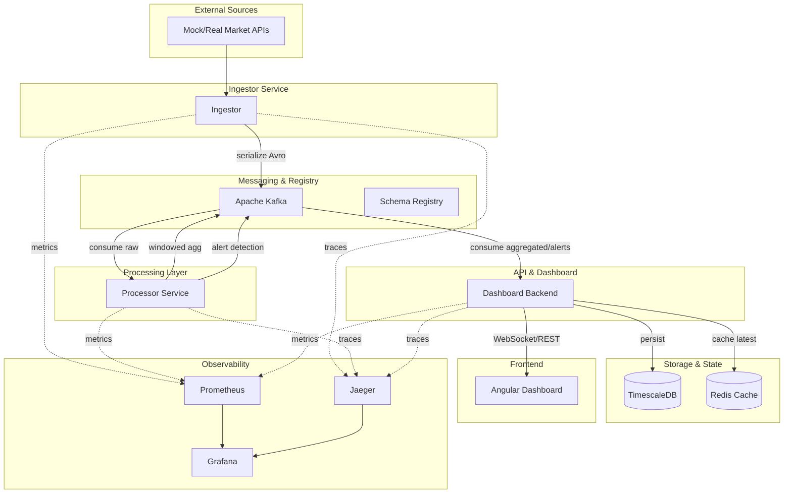
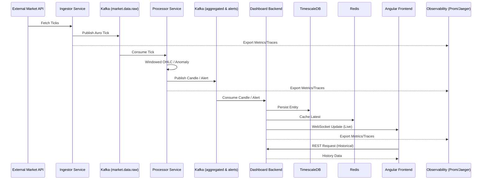

# Market Data Pipeline

A high-performance, enterprise-grade real-time financial data processing engine. This system is designed to ingest thousands of market events per second, process them using stream processing patterns (OHLC candles, anomaly detection), and visualize the results on a live dashboard.

## 🚀 Key Features

*   **High Throughput:** Leveraging **Java 21 Virtual Threads (Project Loom)** for efficient data ingestion.
*   **Stateful Processing:** Real-time windowed aggregations (1-minute and 5-minute OHLC candles) using **Kafka Streams**.
*   **Schema First:** Strong typing and data integrity ensured by **Avro** and **Confluent Schema Registry**.
*   **Time-Series Optimized:** Historical data persistence using **TimescaleDB** (PostgreSQL extension).
*   **Reactive UI:** Real-time updates delivered to an **Angular** frontend via **WebSockets**.
*   **Cloud-Native:** Infrastructure as Code with **Terraform** and **Ansible**, orchestrated on **K3s**.

## 🏗️ Architecture & Flow

### System Overview


### Data Flow Sequence


## 🛠️ Tech Stack

*   **Backend:** Java 21, Spring Boot 3.4, Gradle
*   **Streaming:** Apache Kafka (KRaft), Kafka Streams, Avro
*   **Storage:** TimescaleDB (PostgreSQL), Redis (Caching)
*   **Frontend:** Angular 18+ (Signals, RxJS, Tailwind CSS)
*   **DevOps:** Docker, Kubernetes (K3s), Terraform, Ansible
*   **Observability:** Prometheus, Grafana, OpenTelemetry, Jaeger

## 🚦 Getting Started

### Prerequisites
*   Docker & Docker Compose
*   Java 21 JDK
*   Node.js & NPM (for frontend)

### Quick Start (Development)

1.  **Spin up infrastructure:**
    ```bash
    docker-compose up -d
    ```

2.  **Run all tests (Recommended):**
    ```bash
    ./scripts/test-all.sh
    ```

3.  **Start individual services:**
    ```bash
    ./gradlew :ingestor-service:bootRun
    ./gradlew :processor-service:bootRun
    ./gradlew :dashboard-backend:bootRun
    ```

## 🧪 Testing

The project includes a comprehensive suite of tests:
*   **Unit Tests:** Business logic verification using JUnit 5 and Mockito.
*   **Topology Tests:** Kafka Streams logic validation using `TopologyTestDriver`.
*   **Context Tests:** Spring Boot application context and configuration validation.

Use the provided automation script to run everything:
```bash
./scripts/test-all.sh
```

## 📂 Project Structure

```text
.
├── common/             # Avro schemas and shared DTOs
├── ingestor-service/   # Data ingestion (Loom + Producer)
├── processor-service/  # Kafka Streams logic
├── dashboard-backend/  # WebSockets, Redis & Persistence
├── observability/      # Prometheus & Grafana configuration
├── scripts/            # Automation (tests, setup)
├── docker-compose.yml  # Local infrastructure
└── build.gradle        # Root build configuration
```

