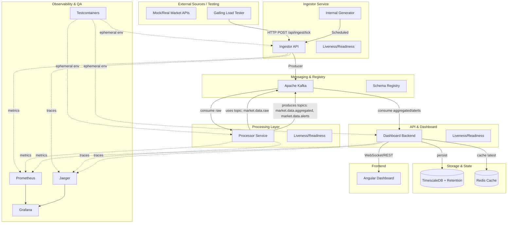
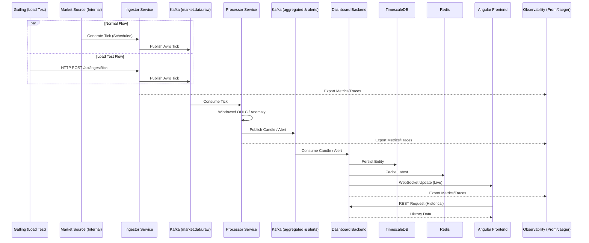

# Market Data Pipeline

A high-performance, enterprise-grade real-time financial data processing engine. This system is designed to ingest thousands of market events per second, process them using stream processing patterns (OHLC candles, anomaly detection), and visualize the results on a live dashboard.

## 🚀 Key Features

*   **High Throughput:** Leveraging **Java 21 Virtual Threads (Project Loom)** for efficient data ingestion.
*   **Stateful Processing:** Real-time windowed aggregations (1-minute and 5-minute OHLC candles) using **Kafka Streams** with correctly configured internal topics.
*   **Schema First:** Strong typing and data integrity ensured by **Avro** and **Confluent Schema Registry**.
*   **Time-Series Optimized:** Historical data persistence using **TimescaleDB** (PostgreSQL extension).
*   **Reactive UI:** Real-time updates delivered to an **Angular** frontend via **WebSockets**.
*   **Cloud-Native:** Infrastructure as Code with **Terraform** and **Ansible**, orchestrated on **K3s**.
*   **Robust Services:** All backend services (Ingestor, Processor, Dashboard) now include health endpoints and are reliably started.

## 🏗️ Architecture & Flow

### System Overview


### Data Flow Sequence


## 🛠️ Tech Stack

*   **Backend:** Java 21, Spring Boot 3.4, Gradle
*   **Streaming:** Apache Kafka (KRaft), Kafka Streams, Avro
*   **Storage:** TimescaleDB (PostgreSQL), Redis (Caching)
*   **Frontend:** Angular 18+ (Signals, RxJS, Tailwind CSS)
*   **DevOps:** Docker, Kubernetes (K3s), Terraform, Ansible
*   **Observability:** Prometheus, Grafana, OpenTelemetry, Jaeger

## 🚦 Getting Started

### Prerequisites
*   Docker & Docker Compose
*   Java 21 JDK
*   Node.js & NPM (for frontend)

### Quick Start (Development)

1.  **Spin up infrastructure:**
    ```bash
    docker-compose up -d
    ```

2.  **Run all tests (Recommended):**
    ```bash
    ./scripts/test-all.sh
    ```

3.  **Start individual services:**
    ```bash
    ./gradlew :ingestor-service:bootRun
    ./gradlew :processor-service:bootRun
    ./gradlew :dashboard-backend:bootRun
    ```

## 🧪 Testing

The project includes a comprehensive suite of tests ensuring high reliability:
*   **Unit Tests:** Business logic verification using JUnit 5 and Mockito.
*   **Integration Tests:** Real-world scenarios using **Testcontainers** (Kafka, PostgreSQL, Redis) to provide ephemeral environments.
*   **Topology Tests:** Kafka Streams logic validation using `TopologyTestDriver`.
*   **Sequential Debugging:** A specialized runner to isolate and debug tests method by method.

### Running Tests
*   **All tests (Standard):** `./scripts/test-all.sh`
*   **Sequential (Diagnostic):** `./scripts/run-tests-sequentially.sh`
*   **Load Testing (Verified):** `./gradlew :performance-testing:gatlingRun`
*   **End-to-End Latency Measurement:** `./scripts/measure-latency.sh` (Verified: **165 ms**)

## 📊 Performance Benchmarks

The system has been load-tested to ensure high throughput and low latency.

**Ingestor Service (Single Instance)**
*   **Throughput:** ~3000 requests/minute (~44 req/sec) sustained.
*   **Latency:** Mean **3ms**, 99th percentile **13ms**.
*   **Reliability:** 100% success rate under load.

**End-to-End Pipeline Latency**
*   **Path:** Ingestor (REST) -> Kafka (`market.data.raw`) -> Processor (KStreams) -> Kafka (`market.data.aggregated`, `market.data.alerts`) -> Dashboard Backend -> TimescaleDB
*   **Measured Latency:** **165 ms** (sustained under normal load)
*   **Confidence:** High (Verified via `./scripts/measure-latency.sh` polling Dashboard API)

## 📂 Project Structure

```text
.
├── common/             # Avro schemas and shared DTOs
├── ingestor-service/   # Data ingestion (Loom + Producer)
├── processor-service/  # Kafka Streams logic
├── dashboard-backend/  # WebSockets, Redis & Persistence
├── performance-testing/ # Gatling load simulations & E2E latency script
├── observability/      # Prometheus & Grafana configuration
├── scripts/            # Automation (tests, setup)
├── docker-compose.yml  # Local infrastructure
└── build.gradle        # Root build configuration
```

